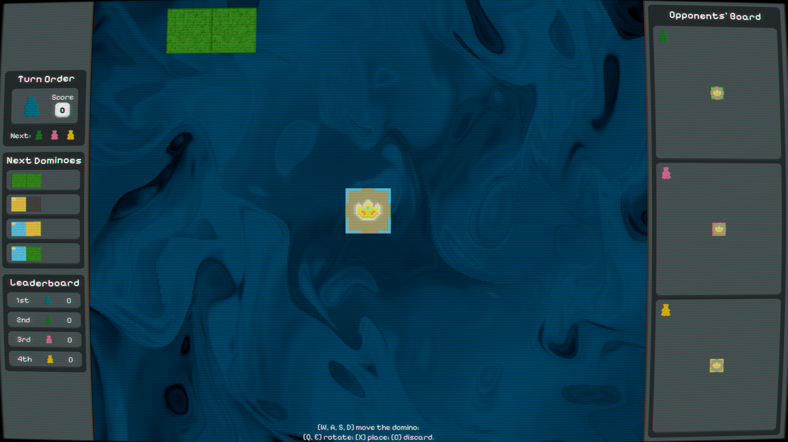

# Kingdomino



This project implements a digital version of the Kingdomino board game. It features:

- **Core Module**: Game logic (game states, tile mechanics, scoring, etc.)
- **Assets**: Visual resources and shaders
- **Documentation**:
  - [Main technical report](docs/latex/main.tex) with detailed analysis of:
    - Problem description
    - Proposed approaches & architecture
    - Implementation details and structure
    - Graphical features & enhancements
    - Results and conclusion
  - Additional references in the [docs](docs/) folder

## Quick Build Instructions

On Windows (from project root):

```bash
.\gradlew build
```

## Project structure

- /core: Primary engine and rules
- /assets: Sprites, artwork, and shaders
- /docs/latex: Main LaTeX files and exported diagrams

## Technical Report

The LaTeX documents cover:

- Overall architecture and data flow
- Visualization concepts and effects
- Collaboration and version control approach
- Testing strategy and performance results

For more information, see the [main.pdf](docs/latex/main.pdf).

## Authors

- [Hai Duong, Tran](https://github.com/fuisl)
- [Pham Minh Tuan, Bui](https://github.com/LunaciaDev)

## Issues

Please raise any issues or bugs in the [Issues](https://github.com/fuisl/kingdomino/issues) tab.
